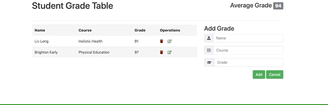

# Student Grade Table
An interactive JavaScript application that communicates with a server to manage grade records.

## Live Demo
https://student-grade-table.ryangriego.com/

## Technologies Used:
* Vanilla JS
* AJAX
* HTML5
* CSS3
* Bootstrap 4

 ## Preview
 

## Features:
* User can view all student grades
* User can add a new grade
* User can delete a grade
* User can update a grade, student name or course
